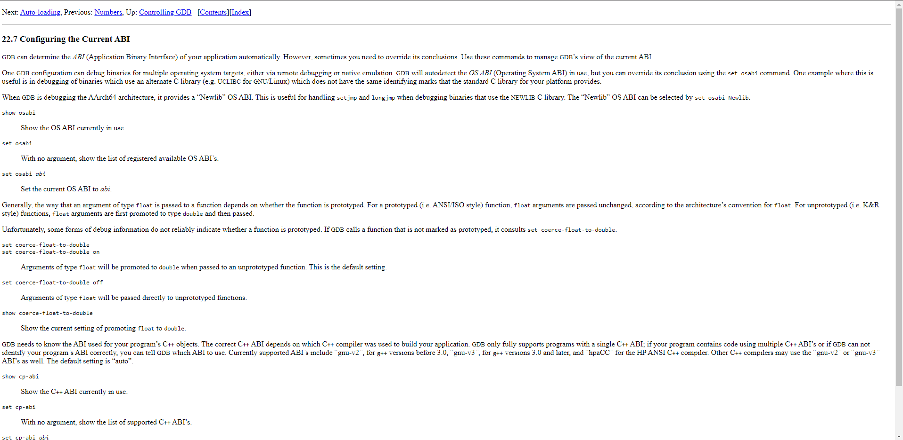
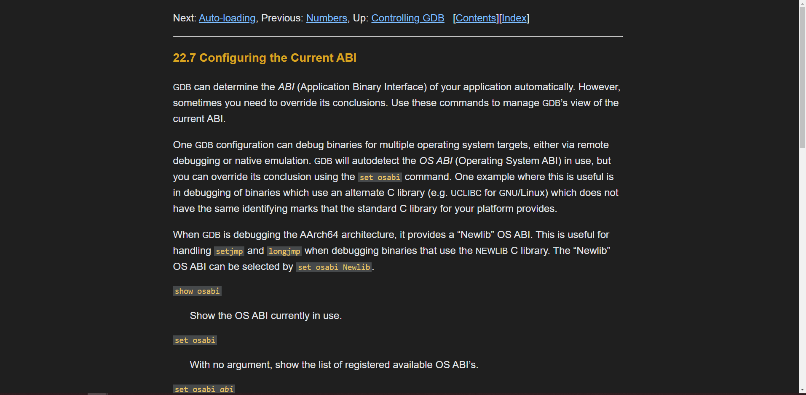

# Bare CSS

Inject CSS into Pages with no CSS!

## Introduction

This small chrome extension is made to give unformatted web pages some basic styling to improve readability. It is highly opinionated, and not customizable.

## Example

  
  

## License

This project is licensed using the MIT license.

### Resources

The extension icon is taken from https://www.flaticon.com/free-icon/injection_3182577?term=injection&page=1&position=24&page=1&position=24&related_id=3182577&origin=tag.
